# Sw.Work — ER Diagram

ทุกตารางใช้ prefix `sw_` แยกขาดจากตารางเดิมของ K2Smart
ออเดอร์ 1 ใบ = เอกสารลูก 1 ชุด (1:1 ทั้ง 5 ใบ + คิวออกแบบ) สร้างอัตโนมัติด้วย trigger `sw_generate_documents`

```mermaid
erDiagram
    sw_customers ||--o{ sw_orders : "สั่งงาน"
    profiles ||--o{ sw_orders : "สร้างโดย (ฝ่ายขาย)"
    sw_orders ||--|| sw_quotations : "1. ใบเสนอราคา"
    sw_orders ||--|| sw_approvals : "2. ใบคอนเฟิร์มลูกค้า"
    sw_orders ||--|| sw_design_tasks : "3. คิวงานออกแบบ"
    sw_orders ||--|| sw_production_sheets : "4. ใบสั่งผลิต"
    sw_orders ||--|| sw_qc_checklists : "5. ใบตรวจคุณภาพ"
    sw_orders ||--|| sw_deliveries : "6. ใบจัดส่ง"
    sw_orders ||--o{ sw_order_files : "ไฟล์งาน/Mockup"
    sw_orders ||--o{ sw_status_history : "ประวัติสถานะ"

    sw_customers {
        uuid id PK
        text name
        text phone
        text line_id
        text company
    }

    sw_orders {
        uuid id PK
        text order_code UK "SWYYMM-0001"
        uuid customer_id FK
        text customer_name
        text product_type "acrylic_keychain | acrylic_sign | light_box | sticker | label | standee | pvc_board"
        numeric width
        numeric height
        text size_unit "cm | mm | inch | m"
        int quantity
        text shape "circle | square | rectangle | die_cut | custom"
        text material "acrylic_3mm | acrylic_5mm | acrylic_frost | pvc | pp_board | sticker"
        text printing "side_1 | side_2 | uv | uv_white | uv_white_varnish"
        bool has_hole
        text hole_position
        text hole_size
        text_arr accessories "ring | star_ring | heart_ring | chain | tassel"
        text notes
        numeric unit_price
        numeric discount
        bool vat_enabled
        numeric total
        text status "quotation → ... → completed"
        date due_date
        uuid created_by FK
    }

    sw_quotations {
        uuid id PK
        uuid order_id FK
        text doc_number UK "Q-SWYYMM-0001"
        jsonb items
        numeric subtotal
        numeric discount
        numeric vat
        numeric total
        date valid_until
        text status "draft | sent | approved | rejected"
        text_arr sent_via "line | email | pdf"
    }

    sw_approvals {
        uuid id PK
        uuid order_id FK
        text doc_number UK "CA-SWYYMM-0001"
        text mockup_url
        text product_image_url
        text decision "pending | approved | revision"
        text customer_note
        text signature_name
        timestamptz decided_at
        int revision_count
    }

    sw_design_tasks {
        uuid id PK
        uuid order_id FK
        text status "waiting_design | designing | sent_confirm | waiting_approval | ready_production"
        uuid designer_id FK
        text designer_name
        timestamptz started_at
        timestamptz finished_at
    }

    sw_production_sheets {
        uuid id PK
        uuid order_id FK
        text doc_number UK "PS-SWYYMM-0001"
        bool white_layer
        bool varnish_layer
        text cut_line
        text hole_position
        text qr_payload "SWWORK|<order_code>|<order_id>"
        text machine
        text operator_name
        text status "waiting | printing | cutting | finishing | done"
    }

    sw_qc_checklists {
        uuid id PK
        uuid order_id FK
        text doc_number UK "QC-SWYYMM-0001"
        bool check_size
        bool check_color
        bool check_quantity
        bool check_hole
        bool check_material
        bool check_packing
        bool passed
        text inspector_name
        text note
        timestamptz checked_at
    }

    sw_deliveries {
        uuid id PK
        uuid order_id FK
        text doc_number UK "DL-SWYYMM-0001"
        text carrier
        text tracking_number
        date ship_date
        text address
        text status "waiting | packed | shipped | delivered"
    }

    sw_order_files {
        uuid id PK
        uuid order_id FK
        text file_name
        text file_type "jpg | png | ai | pdf | psd"
        text storage_path "bucket: sw-work-files"
        text public_url
        text kind "artwork | mockup | reference | slip"
    }

    sw_status_history {
        uuid id PK
        uuid order_id FK
        text from_status
        text to_status
        uuid changed_by FK
        timestamptz created_at
    }
```

## Trigger อัตโนมัติ

| Trigger | เมื่อ | ทำอะไร |
|---|---|---|
| `sw_orders_generate_documents` | insert `sw_orders` | สร้าง quotation + approval + design task + production sheet + qc checklist + delivery ครบชุด |
| `sw_orders_log_status` | insert/update `sw_orders` | บันทึกลง `sw_status_history` |
| `*_touch` | update ทุกตารางหลัก | อัปเดต `updated_at` |

## RLS

ทุกตาราง: ผู้ใช้ที่ล็อกอิน (authenticated) อ่าน/สร้าง/แก้ได้ทั้งหมด, ลบได้เฉพาะ `Owner / Manager / Admin` (ตาม `public.current_role()` ของ K2Smart) — แอปคุมการมองเห็นผ่านเมนูตามบทบาท เช่นเดียวกับตารางเดิมของระบบ
